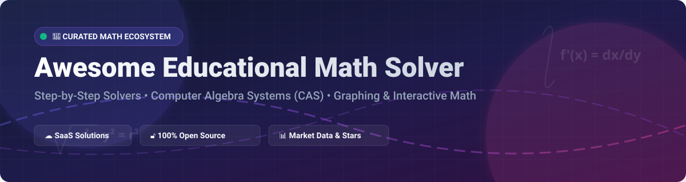

# Awesome Educational Math Solver 🧮✨

  
  
  
  

---

## 🌟 Overview & Features 🚀

Welcome to the ultimate curated list of **Educational Math Solvers**, **Computer Algebra Systems (CAS)**, **Graphing Calculators**, and **Step-by-Step Math Problem Solvers**. Whether you are a student, educator, researcher, or self-learner, this directory provides a comprehensive comparison of top commercial SaaS platforms and production-proven open-source tools.

---

## 📖 Table of Contents 📑

- [☁️ SaaS & Hosted Platforms](#-saas--hosted-platforms-)
- [🔓 Open-Source GitHub Projects](#-open-source-github-projects-)
- [🤝 How to Contribute](#-how-to-contribute-)
- [💖 Support & Sponsorship](#-support--sponsorship-)
- [⭐ Star History](#-star-history)
- [⚠️ Disclaimer](#%EF%B8%8F-disclaimer-)

---

## ☁️ SaaS & Hosted Platforms 🌐

> **📊 Market Context & Size**: The global educational math solver software market is estimated at **~$2.5 Billion in 2026** and projected to reach **~$6.0 Billion by 2032** (CAGR ~15.7%). The sector is **moderately fragmented**: leading category pioneers like **Photomath (Google)**, **Microsoft Math Solver**, **Symbolab**, and **Wolfram Alpha** hold significant user share, but niche apps continuously gain traction by offering distinct step-by-step depth, interactive tutoring, or specialized input methods.

### 💰 SaaS Product Comparison Table 📈

| App / Platform | Description | Pricing (Starting Tier) | Free Tier / Trial Limits | Company Size (Revenue / Valuation) |
| :--- | :--- | :--- | :--- | :--- |
| **[Microsoft Math Solver](https://mathsolver.microsoft.com/)** | **Microsoft's completely free math solver.** Camera, handwriting, and typing input in **50+ languages**. Step-by-step solutions, graphing, and practice problems. | **$0.00/mo** (Completely Free) | **Unlimited** — 100% free step-by-step solutions with no paywall across Web, Edge, OneNote, and Teams. | **~$281 Billion Revenue** (Microsoft FY25) |
| **[Photomath](https://photomath.com/)** | **Category-defining scan-to-solve mobile app.** Camera equation scanning, step-by-step arithmetic to calculus working, and animated tutorials. | **$9.99/mo** (or $69.99/yr for Photomath Plus) | **Free Forever** for basic equation solutions & basic steps; Animated tutorials & deep textbook walkthroughs require Plus. | **Part of Alphabet/Google (~$350B Revenue / ~$2.2T Valuation)** |
| **[Socratic by Google](https://socratic.org/)** | **AI-powered learning and photo math app.** Analyzes homework photos and connects to visual step-by-step breakdowns and video explainers. | **$0.00/mo** (Completely Free) | **Unlimited** — 100% free visual problem solving & step explanations for students. | **Part of Alphabet/Google (~$350B Revenue / ~$2.2T Valuation)** |
| **[Wolfram Alpha](https://www.wolframalpha.com/)** | **Definitive computational knowledge engine.** Expert-level symbolic math, differential equations, linear algebra, and step-by-step explanations. | **$9.99/mo** (Wolfram|Alpha Pro, or $7.00/mo billed annually) | **Free Forever** for final answers & graph generation; Full step-by-step working requires Pro. | **~$100 Million+ Estimated Revenue** (Private, Wolfram Research) |
| **[Symbolab](https://www.symbolab.com/)** | **Step-by-step math solver & calculator.** Deep algebraic manipulation, calculus step breakdowns, geometry, and practice quizzes. | **$9.99/mo** (or $39.99/yr for Symbolab Pro) | **Free Forever** with daily step-by-step limits; Pro unlocks unlimited steps & practice tests. | **~$30 Million Estimated Valuation** (Private) |
| **[Mathway](https://www.mathway.com/)** | **Instant problem solver across all math levels.** Multi-path solutions from basic math to chemistry, physics, and calculus. | **$9.99/mo** (or $39.99/yr for Mathway Premium) | **Free Forever** for instant answers & graph views; Step-by-step solution steps require Premium. | **Part of Chegg (~$600M Revenue)** |
| **[Maple Calculator](https://www.maplesoft.com/products/maplecalculator/)** | **Engineering-grade mobile solver powered by Maple.** Solves algebra, calculus, matrix equations, and plots 2D/3D functions. | **$6.99/mo** (In-App Purchase / Maple Subscription) | **Free Forever** for basic calculations & 2D/3D graph visualization; Advanced CAS features require subscription. | **Part of Cybernet Systems (~$150M Parent Revenue)** |
| **[GeoGebra](https://geogebra.org/)** | **Dynamic mathematics software for education.** Interactive geometry, algebra, spreadsheet, graphing, calculus, and CAS. | **$0.00/mo** (Completely Free for non-commercial) | **Unlimited** — Fully free interactive learning suite used by over 100M students worldwide. | **Part of Byju's (~$300M Acquisition in 2021)** |
| **[Cymath](https://www.cymath.com/)** | **Focused step-by-step math problem solver.** Automatic topic breakdown for algebra, calculus, and equation solving. | **$4.99/mo** (Cymath Plus) | **Free Forever** for basic step-by-step explanations with ads; Plus removes ads and adds reference steps. | **Private Bootstrapped (~$2M Estimated Revenue)** |

---

## 🔓 Open-Source GitHub Projects 🛠️

The open-source math software ecosystem is **exceptionally mature and production-proven**. Below is a curated list of top open-source projects ranked by community popularity on GitHub:

| Project & Description | GitHub Stars Badge 🌟 | License 📜 |
| :--- | :--- | :--- |
| **[GeoGebra](https://github.com/geogebra/geogebra)** — **Free dynamic mathematics software for learning and teaching.** Interactive geometry, algebra, graphing, statistics, and calculus with interactive 3D graphs and classroom activities. |  | GPL-3.0 |
| **[SageMath](https://github.com/sagemath/sage)** — **Comprehensive open-source mathematics software system.** Built on top of Python, NumPy, SciPy, and SymPy. Provides university-grade CAS capabilities for algebra, geometry, calculus, and number theory. |  | GPL-2.0 |
| **[microMathematics Plus](https://github.com/mkulesh/microMathematics)** — **100% open-source Android scientific worksheet calculator.** Maximum privacy (no ads, no telemetry, no permissions). Supports 3D plotting, complex numbers, derivatives, integrals, and LaTeX export. |  | GPL-3.0 |
| **[Maxima](https://github.com/maxima-project-on-github/maxima)** — **Full-featured computer algebra system (CAS).** Derived from MIT's historic Macsyma system. Performs symbolic and numerical operations for differential equations, matrices, and Taylor series. |  | GPL-2.0 |
| **[FintamathAndroid](https://github.com/fintarin/FintamathAndroid)** — **Open-source Computer Algebra System app for Android.** Features expression simplification, arbitrary-precision arithmetic, complex numbers, and rich LaTeX expression rendering. |  | GPL-3.0 |
| **[Mathomatic](https://github.com/mathomatic/mathomatic)** — **Portable symbolic math program (CAS).** Solves, simplifies, differentiates, and generates optimized C, Java, and Python math code directly from equations. |  | LGPL-2.1 |
| **[Fralculator](https://github.com/fralsare/fralculator)** — **Offline-first, step-by-step desktop calculator with live graphing.** KaTeX rendering, offline voice input via Whisper WASM, Plotly live graphing, and 100% local processing. |  | MIT |
| **[KIWI Calc](https://github.com/jonaprojects/kiwicalc)** — **Powerful desktop math tool for equation solving.** Handles calculus operations, vector algebra, mathematical series expansion, and matrix transformations. |  | MIT |
| **[JACAL](https://github.com/jacal/jacal)** — **GNU interactive symbolic mathematics system.** Manipulates and simplifies mathematical equations, vectors, matrices, and transcendental functions like Lambert-W. |  | GPL-3.0 |
| **[Gomez](https://github.com/datamole-ai/gomez)** — **Rust-based framework for mathematical optimization.** Provides robust routines for solving systems of non-linear equations and non-convex optimization problems. |  | Apache-2.0 |
| **[PyCalc](https://github.com/Garl4nd/PyCalc)** — **Python-based evaluator, solver, and plotter.** Interactive GUI calculator for plotting functions and evaluating symbolic mathematical expressions. |  | MIT |

---

## 🤝 How to Contribute 🛠️

We welcome contributions from the community! To submit a new project or update existing details:

1. **Fork** this repository.
2. Add your tool to `README.md` in the appropriate table adhering to the formatting rules.
3. Verify links, pricing, free limits, and open-source licenses.
4. Submit a **Pull Request** with a clear explanation of your additions.

Check out our curated meta-list at **[Awesome-Awesome-Awesome](https://github.com/ishandutta2007/Awesome-Awesome-Awesome)** for more awesome software resources!

---

## 💖 Support & Sponsorship ☕

If you found this curated list helpful for your studies, research, or development projects, please consider supporting the project!

- ⭐ **Star** this repository to help others discover it.
- 🔄 **Share** with classmates, teachers, and colleagues.
- ☕ **Sponsor / Buy me a coffee**: If you'd like to support ongoing maintenance and research, visit the [GitHub Sponsor Dashboard](https://github.com/sponsors/ishandutta2007).

Thank you for being part of the open-source mathematics community! ❤️

---

## 📈 Star History

---

## ⚠️ Disclaimer 📌

- This list is **community-curated** for educational purposes and does not constitute an endorsement.
- Educational institutions should review privacy policies before adopting any SaaS tool for student use.
- **Privacy Spotlight**: Tools like **microMathematics Plus** operate entirely offline with zero telemetry, making them ideal for strict data privacy requirements.
